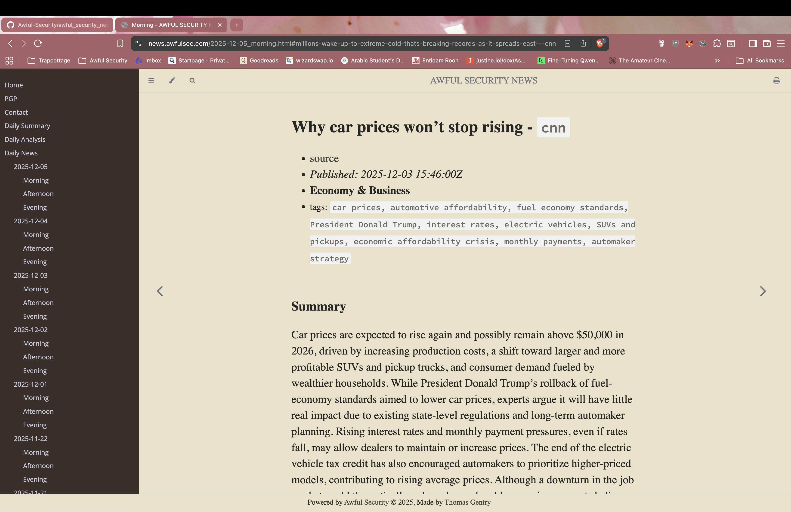

# Awful Security News

An automated daily news aggregation and narrative analysis platform for security and technology news.

**Website:** [news.awfulsec.com](https://news.awfulsec.com)



## Overview

Awful Security News fetches articles from multiple security/technology news sources, summarizes them using an LLM (Qwen 3 4B), generates D3.js visualizations analyzing media narratives, and publishes everything through an mdBook-based static site with Elasticsearch full-text search.

The site updates automatically 3 times daily (6am, 12pm, 6pm Eastern) via systemd timers.

## Architecture

```
                         SYSTEMD TIMER (3x daily)
                                  |
                                  v
                          just run-edition
                                  |
     +----------------------------+----------------------------+
     |                            |                            |
     v                            v                            v
awful_text_news           awful_news_vibes              mdbook build
(news + summaries)      (narrative analysis)          (static HTML)
     |                            |                            |
     v                            v                            v
  api_out/                      viz/                     output/site/
  (JSON API)              (viz JSON data)               (HTML pages)
                                  |
                                  v
                          index_elasticsearch
                                  |
                                  v
                            Elasticsearch
                                  |
                                  v
                         Caddy (web server)
                                  |
                                  v
                        news.awfulsec.com
```

## Features

- **Automated News Aggregation**: Fetches and summarizes security news from multiple sources
- **LLM Summarization**: Uses Qwen 3 4B for article summarization
- **Narrative Analysis**: D3.js visualizations showing:
  - Story Momentum (coverage velocity)
  - Narrative Divergence (how outlets frame stories differently)
  - Emotional Temperature (tone analysis)
  - Story Compass (sentiment/complexity positioning)
  - Silence Tracker (notably absent narratives)
  - Story Fingerprints (uniqueness metrics)
  - Word Clouds (term frequency by outlet)
  - Story Lifecycles (coverage patterns over time)
- **Full-Text Search**: Elasticsearch-powered search across all content
- **Static Site**: Fast, secure mdBook-generated HTML

## Project Structure

```
awful_security_news/
├── src/                    # mdBook source (Markdown content)
│   ├── SUMMARY.md          # Table of contents
│   ├── daily_summary.md    # Latest analysis (auto-updated)
│   ├── 2025-*.md           # Daily news editions
│   └── theme/              # Custom mdBook theme with Elasticsearch search
├── assets/                 # Static assets and scripts
├── docker/                 # Docker Compose configs
├── systemd/                # Systemd service files
├── scripts/                # Shell scripts
├── api_out/                # Generated API JSON
├── viz/                    # Generated visualization data
├── output/                 # Built site (served by Caddy)
├── Justfile                # Build orchestration (Nushell)
└── book.toml               # mdBook configuration
```

## Quick Start

### Prerequisites

- [Rust](https://www.rust-lang.org/tools/install)
- [Nushell](https://www.nushell.sh/)
- [Just](https://github.com/casey/just)
- [Docker](https://docs.docker.com/get-docker/)
- Node.js 18+

### External Binaries (not in repo)

These must be installed separately:

- `awful_text_news` - News fetching and LLM summarization
- `awful_news_vibes` - Narrative analysis and visualization generation
- `mdbook` - Static site builder
- `mdbook-sitemap-generator` - SEO sitemap generation

### Installation

```bash
# Clone the repository
git clone https://github.com/graves/awful_security_news
cd awful_security_news

# Install mdBook
cargo install mdbook mdbook-sitemap-generator

# Install Node dependencies (for search indexer)
npm install

# Start Docker services (Elasticsearch)
just up

# Run a full edition build
just run-edition
```

### Common Commands

```bash
# Build and deploy
just run-edition          # Full build pipeline
just build-only           # Build without Elasticsearch indexing
just force-vibes          # Generate viz data (ignores morning-only restriction)
just update-viz-index     # Regenerate viz/index.json

# Docker services
just up                   # Start Elasticsearch
just down                 # Stop services
just status               # Show container status
just es-status            # Check Elasticsearch health

# Deployment (requires sudo)
just install-services     # Install systemd service files
just enable-services      # Enable and start services
just deploy               # Full deployment workflow
```

## Build Pipeline

The `just run-edition` command executes:

1. **check-binaries** - Verify required binaries exist
2. **ensure-output-dirs** - Create output directories
3. **generate-content** - Run `awful_text_news` to fetch news and generate Markdown
4. **generate-vibes** - Run `awful_news_vibes` for narrative analysis (morning only)
5. **copy-meta-post** - Copy latest analysis to daily_summary.md
6. **build-site** - Build mdBook, copy assets, generate robots.txt and sitemap
7. **update-viz-index** - Regenerate viz/index.json
8. **copy-outputs** - Sync API and viz data to output directory
9. **index-elasticsearch** - Index HTML content for search

## Deployment

The site runs on a Debian server with:

- **Caddy** - Web server (host-level) serving static files and proxying Elasticsearch
- **Elasticsearch** - Full-text search backend (Docker container)
- **systemd timers** - Scheduled builds at 6am, 12pm, 6pm Eastern

```bash
# Deploy to server
just deploy

# Update existing deployment
just update
```

## Related Projects

- [awful_text_news](https://github.com/graves/awful_text_news) - News fetching and LLM summarization
- [awful_news_vibes](https://github.com/graves/awful_news_vibes) - Narrative analysis and visualization

## License

MIT
