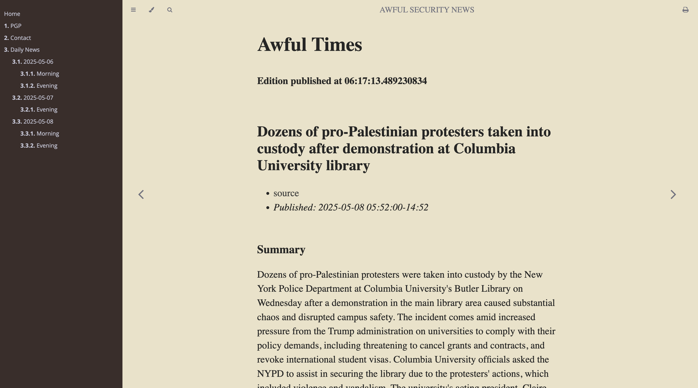

# Awful Security News

## Source code for a personal website and blog.

This website is hosted at [Awful Security dot com](https://news.awfulsec.com). 

The blog is built using the wonderful [mdBook](https://github.com/rust-lang/mdBook).

> mdBook is a utility to create modern online books from Markdown files.

The index page and individual posts are written in [Markdown](https://github.com/adam-p/markdown-here/wiki/Markdown-Cheatsheet), compiled using mdBook, and it's output pushed to my [awful_security_news repo](https://github.com/graves/awful_security_news).

The result is a daily news summarization publication in the style of Rust's documentation.

## Hacking / Contributing

To begin hacking on the blog (to perhaps use as a starting point for your own) you must first [install Rust](https://www.rust-lang.org/tools/install) and then mdBook.

`cargo install mdbook`

Once the prerequisitees are out of the way hacking is as simple as cloning the repository

`git clone https://github.com/graves/awful_security_news`

 Please see [awful_text_news](https://github.com/graves/awful_text_news) for a way to automatically populate the site with contents.
